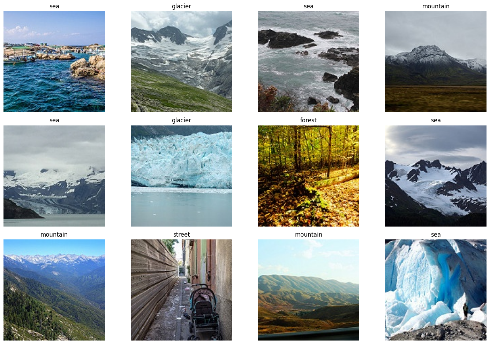

# cnn-image-classifier
Image classification with Convolution Neural Networks(CNNs)    
This project uses a Convolution Neural Network to classify images among  different categories like buildings, sea, glaciers, mountains, sea and forest.
The notebook demonstrates:
Dataset preprocessing
Training a CNN
Evaluating the model using accuracy/loss plots
Predicting classes for new images

# Dataset

The dataset is organized inside the `archive` folder as follows:

**Train folder** – Images used for training the model:  
- `category1-buildings/`  
  - `img1.jpg`  
  - `img2.jpg`  
  - …  
- `category2-mountains/`  
  - `img1.jpg`  
  - `img2.jpg`  
  - …  
- …  

**Test folder** – Images used for testing/validation:  
- `category1-buildings/`  
  - `img1.jpg`  
  - `img2.jpg`  
  - …  
- `category2-mountains/`  
  - `img1.jpg`  
  - `img2.jpg`  
  - …  
- …  

**Prediction folder (`pred`)** – Images used for making predictions:  
- `img1.jpg`  
- `img2.jpg`  
- `img3.jpg`  
- `img4.jpg`  
- …

# Dataset Description
**Source:** Intel Image Classification Dataset  

**Structure:**
- `seg_train/` — Training images organized by class  
- `seg_test/` — Test images organized by class  
- `seg_pred/` — Images for prediction  

**Image size:** Variable, resized to 150×150 for training  
**Classes:** 6

# How to run
This project is designed to run in Google Colab.

1. Load the dataset from Google Drive  
   - Upload the `archive` folder to Google Drive.  
   - Mount Google Drive in Colab using python
         from google.colab import drive
         drive.mount('/content/drive')
   - Set Datapaths
     **train_path =** "/content/drive/My Drive/IntelDataset/seg_train"
     **test_path  =** "/content/drive/My Drive/IntelDataset/seg_test"
     **pred_path  =** "/content/drive/My Drive/IntelDataset/seg_pred"
     
2. Preprocess the data
    - Resize images, normalize pixel values, and organize them for training and testing.
    - This is done in the preprocessing cells of the notebook.

3. Train the CNN model
   - The CNN is trained on images from archive/train and validated using archive/test.
   - The notebook plots accuracy and loss graphs to show training progress.

4. Evaluate the model
   - Check the model’s performance using accuracy and loss graphs on the test set.
   - 
     **Training Accuracy:** 69.55%
     **Validation Accuracy:** 75.87%
     **Test Accuracy:**  75.40%
   
5. Make predictions on new images
   - Use images in archive/pred to predict their categories.
   - The notebook outputs the predicted category for each image.
   
# Model Architecture 
1. Input Layer
   - Shape: (150, 150, 3)
   - Accepts RGB images resized to 150×150.

2. Conv2D Layer 1
   - Filters: 32, Kernel: 3×3, Activation: ReLU
   - Purpose: Extract low-level features like edges and textures.

3. MaxPooling2D Layer 1
   - Pool size: 2×2
   - Reduces spatial dimensions and computation.

4. Conv2D Layer 2
   - Filters: 64, Kernel: 3×3, Activation: ReLU
   - Extracts higher-level features.

5. MaxPooling2D Layer 2
   - Pool size: 2×2

6. Flatten Layer
   - Converts 2D feature maps into 1D vector for Dense layers.

7. Dense Layer 1
   - Units: 128, Activation: ReLU
   - Learns high-level feature representations.

8. Dropout Layer
   - Rate: 0.5
   - Helps prevent overfitting.

9. Output Dense Layer
   - Units: 6 (number of classes), Activation: Softmax
   - Produces probability distribution over 6 classes.

# Training details
- **Optimizer:** Adam  
- **Learning Rate:** 0.001  
- **Loss Function:** Categorical Crossentropy  
- **Metrics:** Accuracy  
- **Epochs:** 5  
- **Batch Size:** 32 (from train_generator)

# Evaluation
Test accuracy printed after evaluation.
Accuracy and loss graphs plotted for train vs validation.

# Training and Evaluation
The model is trained on seg_train and validated on seg_test.
Training vs Validation Accuracy and Loss are plotted for performance analysis.
Example graphs:

### Accuracy

### Loss

# Predictions
The trained model can predict classes for new images in the seg_pred folder.

# Conclusion
Successfully implemented a CNN for multi-class image classification.
Model achieved high test accuracy and can predict unseen images reliably.
Accuracy and loss plots show stable learning without severe overfitting.
